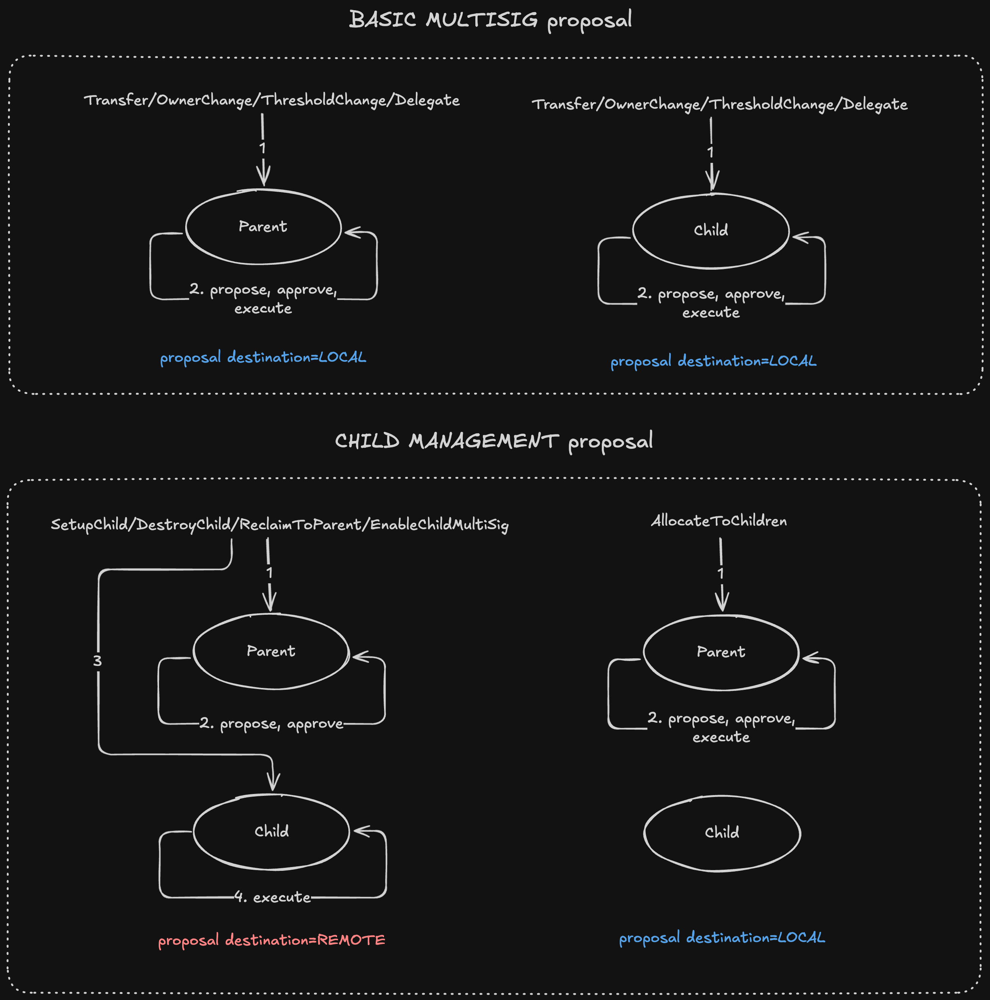

# MinaGuard Architecture

MinaGuard is a hierarchical multisig vault zkApp for Mina, built with o1js. It manages shared funds via a quorum of owner signatures verified inside zero-knowledge circuits, and supports a two-level parent/child guard hierarchy where a root guard can deploy, fund, reclaim from, and destroy child guards. Children cannot themselves be parents.

All execution uses a **multi-step on-chain flow** (propose → approve → execute). A proposal is either **LOCAL** (executes on the same guard that stored it) or **REMOTE** (proposed/approved on a parent, executed on a specific child). Cross-contract authorization is done by having the child read the parent's on-chain state as AccountUpdate preconditions and verify an approval Merkle witness.

## File Layout

| File | Purpose |
| ---- | ------- |
| `MinaGuard.ts` | Contract class, types (structs), events |
| `constants.ts` | `MAX_OWNERS`, `MAX_RECEIVERS`, markers, `TxType` + `Destination` enums |
| `storage.ts` | Off-chain stores: `OwnerStore`, `ApprovalStore`, `VoteNullifierStore` |
| `list-commitment.ts` | Owner chain hash circuits: membership proof, add, remove |
| `utils.ts` | `ownerKey()` helper (`Poseidon.hash(owner.toFields())`) |
| `index.ts` | Public exports |

## On-Chain State (12 Fields)

MinaGuard uses 12 state slots (requires the Mesa 32-slot branch of o1js):

| Slot | Field | Purpose |
| ---- | ----- | ------- |
| 0 | `ownersCommitment` | Chain hash of the ordered owner list |
| 1 | `threshold` | Minimum approvals required to execute any proposal |
| 2 | `numOwners` | Current owner count |
| 3 | `nonce` | Last executed LOCAL nonce on this guard |
| 4 | `voteNullifierRoot` | MerkleMap root preventing double-voting |
| 5 | `approvalRoot` | MerkleMap root of approval counts (`proposalHash → count`) |
| 6 | `configNonce` | Incremented on governance changes; invalidates stale proposals |
| 7 | `networkId` | Network identifier; prevents cross-network replay |
| 8 | `parent` | Parent guard address (`PublicKey.empty()` for a root guard) |
| 9 | `parentNonce` | Last executed REMOTE nonce on this child (`0` on root guards) |
| 10 | `childExecutionRoot` | MerkleMap root marking REMOTE proposals executed on this child |
| 11 | `childMultiSigEnabled` | `Field(1)` if this child accepts its own propose/approve/execute ops, `Field(0)` otherwise |

## Owner Storage Model

Owners are stored as an **ordered list** off-chain. On-chain, a single commitment field represents the entire list via a chain hash:

```
chain = Poseidon.hashWithPrefix('owner-chain', [])   // INITIAL_OWNER_CHAIN
for each owner in list:
  chain = Poseidon.hash([chain, owner.x, owner.isOdd.toField()])
```

This design means the full owner list is the witness, not a Merkle path. The witness type is a fixed-size array:

```typescript
class OwnerWitness extends Struct({
  owners: Provable.Array(Option(PublicKey), MAX_OWNERS)  // MAX_OWNERS = 20
})
```

Active owners are `Some(pk)`, padding slots are `None`. Three circuit functions in `list-commitment.ts` operate on this structure:

- **`assertOwnerMembership`** — Iterates the witness, recomputes the chain hash, checks that the claimed owner appears, and asserts the final chain equals `ownersCommitment`.
- **`addOwnerToCommitment`** — Inserts a new owner into the chain. Accepts an `insertAfter: Option(PublicKey)` parameter: `None` prepends, `Some(pk)` inserts after that key. Returns `[newChain, valid]`. Caller must check `valid` and enforce size bounds.
- **`removeOwnerFromCommitment`** — Rebuilds the chain while skipping the target owner. Returns `[newChain, valid]`. Caller must check `valid` and enforce `numOwners >= threshold`.

## Off-Chain Storage

Three independent store classes in `storage.ts` mirror on-chain roots. Each is self-contained and serializable.

### OwnerStore

An ordered `PublicKey[]` array. Methods: `add()`, `remove()`, `insertAfter()`, `isOwner()`, `getCommitment()` (computes chain hash), `getWitness()` (returns `OwnerWitness` padded to `MAX_OWNERS`). Serializes via JSON with base58-encoded keys.

### ApprovalStore

A `MerkleMap` keyed by `proposalHash`. The value encodes proposal state with a marker offset:

| Value | Meaning |
| ----- | ------- |
| `Field(0)` | Not proposed (MerkleMap default) |
| `PROPOSED_MARKER` (1) | Proposed, 0 approvals |
| `PROPOSED_MARKER + N` | Proposed, N approvals |
| `EXECUTED_MARKER` (max field value) | Executed |

This encoding distinguishes "never proposed" from "proposed with 0 approvals", preventing approval of fabricated proposals.

Methods: `getCount()`, `setCount()`, `getWitness()`, `isExecuted()`, `getRoot()`.

### VoteNullifierStore

A `MerkleMap` keyed by `Poseidon.hash([proposalHash, ...approver.toFields()])`. Value is `Field(0)` (not voted) or `Field(1)` (voted). Prevents the same owner from approving the same proposal twice.

Methods: `isNullified()`, `nullify()`, `getWitness()`, `getRoot()`.

## Proposal Structure

```typescript
class Receiver extends Struct({
  address: PublicKey,
  amount:  UInt64,
})

class TransactionProposal extends Struct({
  receivers:    Provable.Array(Receiver, MAX_RECEIVERS),  // Fixed-size array of recipients
  tokenId:      Field,       // Token ID (Field(0) for MINA)
  txType:       Field,       // TxType value
  data:         Field,       // Context-dependent payload (see below)
  nonce:        Field,       // Ordered execution nonce (LOCAL or child-REMOTE domain)
  configNonce:  Field,       // Must match on-chain configNonce
  expirySlot:   Field,       // Global slot deadline (0 = no expiry)
  networkId:    Field,       // Must match on-chain networkId
  guardAddress: PublicKey,   // Must match the guard the proposal lives on
  destination:  Field,       // LOCAL or REMOTE (see below)
  childAccount: PublicKey,   // Target child for REMOTE; empty for LOCAL
})
```

Unused receiver slots use `Receiver.empty()` (`PublicKey.empty()` + `UInt64(0)`). Non-transfer proposals (governance, child-lifecycle) use all-empty receiver slots unless otherwise noted.

`hash()` returns `Poseidon(all fields)`. This hash is the universal key for approval counts, vote nullifiers, and signatures. Because `guardAddress`, `destination`, and `childAccount` are all inside the hash, a proposal is cryptographically bound to a specific (parent, child) pair — cross-child reuse produces a different hash.

### Hash-keyed approvals with ordered execution nonces

Approvals remain keyed by the full proposal hash, not by nonce. That preserves content binding: owners approve an exact proposal payload, not just a nonce slot. The `nonce` field now serves a different purpose: it orders execution and lets a later approved proposal invalidate an earlier unexecuted proposal that shares the same nonce.

Execution domains:

- **LOCAL proposals** use the guard's `nonce`.
- **REMOTE proposals** use the target child's `parentNonce`.
- **`CREATE_CHILD`** is a special REMOTE case: its `nonce` must be `0`, and `executeSetupChild` initializes the child with `nonce = 1` and `parentNonce = 1`.

### LOCAL vs REMOTE proposals

| `destination` | Flow | Example txTypes |
| ------------- | ---- | --------------- |
| `LOCAL` | Proposed, approved, and executed on the same guard | `TRANSFER`, `ADD_OWNER`, `REMOVE_OWNER`, `CHANGE_THRESHOLD`, `SET_DELEGATE`, `ALLOCATE_CHILD` |
| `REMOTE` | Proposed and approved on the **parent**, executed on the **child** named in `childAccount` | `CREATE_CHILD`, `RECLAIM_CHILD`, `DESTROY_CHILD`, `ENABLE_CHILD_MULTI_SIG` |

REMOTE proposals are never marked executed on the parent's `approvalRoot` — the parent never runs an execute method for them. Replay protection lives on the child in `childExecutionRoot`.

### TxType enum and `data` field usage

| TxType | Value | `destination` | `data` contains | `receivers[0]` contains |
| ------ | ----- | ------------- | --------------- | ----------------------- |
| `TRANSFER` | 0 | `LOCAL` | `Field(0)` | Any recipient (multi-slot allowed) |
| `ADD_OWNER` | 1 | `LOCAL` | `Field(0)` | The owner pubkey to add |
| `REMOVE_OWNER` | 2 | `LOCAL` | `Field(0)` | The owner pubkey to remove |
| `CHANGE_THRESHOLD` | 3 | `LOCAL` | New threshold value | Empty |
| `SET_DELEGATE` | 4 | `LOCAL` | `Field(0)` | Delegate pubkey (empty = undelegate to self) |
| `CREATE_CHILD` | 5 | `REMOTE` | `Poseidon([ownersCommitment, threshold, numOwners])` of the child's initial config | Empty |
| `ALLOCATE_CHILD` | 6 | `LOCAL` | `Field(0)` | Any child recipient (multi-slot allowed) |
| `RECLAIM_CHILD` | 7 | `REMOTE` | Amount to reclaim | Empty |
| `DESTROY_CHILD` | 8 | `REMOTE` | `Field(0)` | Empty |
| `ENABLE_CHILD_MULTI_SIG` | 9 | `REMOTE` | `0` or `1` | Empty |

Propose-time rules enforced in `propose()`:
- `receivers[0]` must be non-empty for `ADD_OWNER`/`REMOVE_OWNER`.
- `receivers[0]` must be empty for `CHANGE_THRESHOLD`.
- Only `TRANSFER` and `ALLOCATE_CHILD` may use more than one receiver slot.
- `data` must be `Field(0)` unless txType is `CHANGE_THRESHOLD`, `CREATE_CHILD`, `RECLAIM_CHILD`, or `ENABLE_CHILD_MULTI_SIG`.
- `destination` and `childAccount` must be consistent: REMOTE requires a non-empty `childAccount`, LOCAL requires an empty one. For REMOTE, `guardAddress` must be the parent.
- `nonce` must be fresh for the relevant execution domain:
  - LOCAL propose/approve requires `proposal.nonce > this.nonce`
  - REMOTE propose/approve requires `proposal.nonce > child.parentNonce`
  - `CREATE_CHILD` requires `proposal.nonce == 0`

## Constants

Defined in `constants.ts`:

| Constant | Value | Purpose |
| -------- | ----- | ------- |
| `MAX_RECEIVERS` | `9` | Fixed-size bound for receiver arrays in proposals. Hard cap from Mina's transaction cost budget — 10 receivers fails proving with "transaction is too expensive" |
| `MAX_OWNERS` | `20` | Fixed-size bound for owner witnesses |
| `INITIAL_OWNER_CHAIN` | `Poseidon.hashWithPrefix('owner-chain', [])` | Chain hash seed for owners |
| `PROPOSED_MARKER` | `Field(1)` | Base value written to approval map on propose |
| `EXECUTED_MARKER` | `Field(0).sub(1)` | Max field value; marks executed LOCAL proposals |
| `EMPTY_MERKLE_MAP_ROOT` | `new MerkleMap().getRoot()` | Initializes `approvalRoot`, `voteNullifierRoot`, `childExecutionRoot` |

## On-Chain Multi-Step Flow

### Deploy

`deploy()` sets account permissions (see Permissions section) and emits a `DeployEvent` with the contract address for indexer discovery.

### Setup

`setup(ownersCommitment, threshold, numOwners, networkId, initialOwners)` — one-time root-guard initialization.

- Guard: `ownersCommitment == Field(0)` (not yet initialized)
- Validates: `threshold > 0`, `numOwners >= threshold`, `numOwners <= MAX_OWNERS`
- Initializes all state fields; `nonce = 0`, `parentNonce = 0`, `approvalRoot`, `voteNullifierRoot`, `childExecutionRoot` set to `EMPTY_MERKLE_MAP_ROOT`; `parent = PublicKey.empty()`; `childMultiSigEnabled = Field(1)`
- Emits `SetupEvent` + one `SetupOwnerEvent` per `MAX_OWNERS` slot
- Trust model: clients should independently compute the expected commitment and verify it matches

### Propose (with auto-approve)

`propose(proposal, ownerWitness, proposer, signature, voteNullifierWitness, approvalWitness)`

There is only one propose method and it **always auto-approves** as the proposer's first vote:

1. Assert `childMultiSigEnabled == 1` if this is a child guard
2. Verify proposer is an owner (chain hash witness)
3. Assert `configNonce`, `networkId`, `guardAddress` match on-chain values
4. Assert `destination` and `childAccount` are consistent
5. Assert proposal nonce freshness for the relevant domain (`nonce` or `parentNonce`; `CREATE_CHILD` requires `0`)
6. Enforce per-txType propose rules (see TxType table)
7. Verify proposer's signature over `[proposalHash]`
8. Check and set vote nullifier (prevents re-proposal)
9. Assert approval slot is empty (`Field(0)`), then write `PROPOSED_MARKER + 1`
10. Emit `ProposalEvent`, `MAX_RECEIVERS` `ReceiverEvent`s, and `ApprovalEvent`

### Approve

`approveProposal(proposal, signature, approver, ownerWitness, approvalWitness, currentApprovalCount, voteNullifierWitness)`

1. Assert `childMultiSigEnabled == 1` if this is a child guard
2. Verify approver is an owner
3. Assert `configNonce`, `networkId`, `guardAddress` match
4. Assert proposal nonce freshness for the relevant domain
5. Verify signature over `[proposalHash]`
6. Assert proposal exists (`count >= PROPOSED_MARKER`) and not executed
7. Check and set vote nullifier
8. Increment approval count in the approval map
9. Emit `ApprovalEvent`

### Execute — LOCAL methods

All LOCAL execute methods share these checks:

- Wallet initialized (`ownersCommitment != 0`)
- `childMultiSigEnabled == 1` if this is a child guard
- `txType` matches the method, `destination == LOCAL`
- `configNonce`, `networkId`, `guardAddress` match on-chain
- `proposal.nonce == this.nonce + 1`
- Proposal not expired (if `expirySlot != 0`, asserts `globalSlotSinceGenesis <= expirySlot`)
- Not executed, exists, and threshold satisfied
- Approval witness verified against `approvalRoot`

After execution the contract increments `nonce` and overwrites the approval count with `EXECUTED_MARKER`, permanently preventing re-execution or further approvals. Execution is **permissionless** — anyone can trigger it once the threshold is met.

- **`executeTransfer`** — Loops through all receiver slots, sending to each non-empty one. Empty slots are converted into zero-value self-sends so they have no effect on balances. Emits `ExecutionEvent`.
- **`executeAllocateToChildren`** — Same structure as `executeTransfer` but asserts `txType == ALLOCATE_CHILD`. Typically sends MINA from a parent to its children. Emits `ExecutionEvent { txType: ALLOCATE_CHILD }`. The indexer distinguishes allocations from generic transfers by txType.
- **`executeOwnerChange`** — Handles both `ADD_OWNER` and `REMOVE_OWNER` via boolean flags. The owner pubkey is read from `receivers[0]`. Runs both `addOwnerToCommitment` and `removeOwnerFromCommitment` circuits and selects the correct result based on `txType`. Asserts `newNumOwners >= threshold` and `<= MAX_OWNERS`. Updates `ownersCommitment` and `numOwners`. Increments `configNonce`. Emits `ExecutionEvent` + `OwnerChangeEvent`.
- **`executeThresholdChange`** — Validates `proposal.data == newThreshold`, `newThreshold > 0`, `numOwners >= newThreshold`. Updates `threshold`. Increments `configNonce`. Emits `ExecutionEvent` + `ThresholdChangeEvent`.
- **`executeDelegate`** — Reads the target delegate from `receivers[0]` (empty slot = undelegate to self). Sets `account.delegate`. Does **not** increment `configNonce`. Emits `ExecutionEvent` + `DelegateEvent`.

## Subaccounts / Child Lifecycle



A child guard is a separate MinaGuard contract instance whose `parent` state field points to another MinaGuard. Child-lifecycle operations (`CREATE_CHILD`, `RECLAIM_CHILD`, `DESTROY_CHILD`, `ENABLE_CHILD_MULTI_SIG`) are REMOTE proposals: proposed and approved on the parent, executed on the child.

The hierarchy is capped at **two levels** (root → child). `propose` asserts that REMOTE proposals (which include `CREATE_CHILD`) can only be raised on a guard whose `parent == PublicKey.empty()` — so only root guards can spawn children, and children cannot themselves become parents.

### Cross-contract precondition model

When the child runs a REMOTE execute method, it reads the parent's on-chain state via:

```typescript
const parentGuard = new MinaGuard(parentAddress);
const parentOwnersCommitment = parentGuard.ownersCommitment.getAndRequireEquals();
const parentConfigNonce      = parentGuard.configNonce.getAndRequireEquals();
const parentNetworkId        = parentGuard.networkId.getAndRequireEquals();
const parentApprovalRoot     = parentGuard.approvalRoot.getAndRequireEquals();
const parentThreshold        = parentGuard.threshold.getAndRequireEquals();
```

Each `getAndRequireEquals()` call pins the parent's state as an AccountUpdate precondition. If any parent field changes between approval and execution (e.g. an `executeOwnerChange` bumps `configNonce`), the precondition fails and the child transaction aborts atomically. The child then verifies a Merkle witness proving the REMOTE proposal reached threshold on `parentApprovalRoot`.

### Child execution replay guard

REMOTE proposals never touch the parent's `approvalRoot` — the parent never runs an execute method for them, so `markExecuted` is not called. Instead, each child maintains its own `childExecutionRoot` MerkleMap. When a child runs a REMOTE execute method, it asserts the proposal's slot in `childExecutionRoot` is `Field(0)` and then writes `EXECUTED_MARKER` via `markChildExecuted`. This is the sole replay guard for REMOTE flows.

Cross-child safety: because `proposalHash` includes `childAccount`, a REMOTE proposal for child A produces a different hash than one for child B even with otherwise identical fields. A proposal approved on the parent and targeted at child A cannot execute on child B — each child asserts `proposal.childAccount == this.address`.

### announceChildConfig

`announceChildConfig(proposalHash, childAccount, ownersCommitment, threshold, numOwners, initialOwners, ownerWitness, caller, signature)` — Runs on the **parent** in the same transaction as `propose()` for a `CREATE_CHILD` proposal. Emits `CreateChildConfigEvent` + 20 `CreateChildOwnerEvent`s so the indexer knows the child's intended owner list before `executeSetupChild` runs.

**Why this method exists:** `executeSetupChild` requires the child's owner list, threshold, and owners commitment as arguments. Without `announceChildConfig`, the `ProposalEvent` only contains a `data` hash (`Poseidon([ownersCommitment, threshold, numOwners])`) — the individual owner addresses are not recoverable from the hash. The executor would need the original proposer to share the child config out-of-band. By emitting the full owner list on the parent at propose time, any user can retrieve the config from on-chain events and execute `setupChild` without coordinating with the proposer.

Guards:
- **Root-only**: asserts `this.parent == PublicKey.empty()` — children cannot announce child configs.
- **Owner auth**: verifies `caller` is an owner via chain hash witness, and `signature.verify(caller, [proposalHash])`. The proposer reuses the same signature used for `propose()`.

The method is stateless (no state reads/writes beyond the root-guard and owner checks). The `initialOwners` array is not verified against `ownersCommitment` on-chain — since only authenticated owners can call this method, a rogue owner could announce mismatched owner addresses in the events (e.g., substituting a different set of owners while keeping the real `ownersCommitment`). This would not affect on-chain security (`executeSetupChild` validates the commitment independently), but would cause the indexer to display incorrect pending owner lists.

Both the UI worker (`executeSetupChildOnchain`) and the offline CLI (`handleExecute` for createChild) validate the announced config before building the execute transaction: they compute `Poseidon([ownersCommitment, threshold, numOwners])` from the announced owner list and assert it matches the proposal's `data` field. A mismatch throws an error before proof generation, preventing wasted computation on tampered event data.

### Child lifecycle methods

All four child-lifecycle `@method`s run on the child, take parent-approval inputs `(parentApprovalWitness, parentApprovalCount)`, and emit `ExecutionEvent` alongside their specific event.

- **`executeSetupChild(ownersCommitment, threshold, numOwners, initialOwners, proposal, parentApprovalWitness, parentApprovalCount)`** — Called on a child that was already deployed (at propose time) but not yet initialized. The child sits with `ownersCommitment == 0` between deploy and this call; see "Security: uninitialized child window" in the UI model section for the attack surface analysis. Asserts `txType == CREATE_CHILD`, `destination == REMOTE`, `proposal.childAccount == this.address`, `proposal.nonce == 0`, and `proposal.data == Poseidon([ownersCommitment, threshold, numOwners])`. Verifies the parent approval state inline (since `this.parent` isn't persisted yet, the parent address comes from `proposal.guardAddress`). Uses `proposal.networkId` as the child's `networkId` — `assertParentApprovalState` pins the parent's `networkId` as an AccountUpdate precondition, so `proposal.networkId` is the parent-approved value and an attacker can't supply a mismatched id via this path. Initializes all state with `nonce = 1` and `parentNonce = 1`, emits `SetupEvent`, `SetupOwnerEvent`s, `ExecutionEvent`, `CreateChildEvent`.
- **`executeReclaimToParent(proposal, parentApprovalWitness, parentApprovalCount, childExecutionWitness, amount)`** — Sends `amount` MINA back to `this.parent`. Asserts `proposal.data == amount.value`, `proposal.nonce == this.parentNonce + 1`, increments `parentNonce`, and marks the proposal in `childExecutionRoot`. Emits `ExecutionEvent` + `ReclaimChildEvent { proposalHash, parentAddress, amount }`. Does **not** check `childMultiSigEnabled` — this is a deliberate recovery path that works even when the child is disabled.
- **`executeDestroy(proposal, parentApprovalWitness, parentApprovalCount, childExecutionWitness)`** — Sends the full child balance to the parent, sets `childMultiSigEnabled = 0`, increments `parentNonce`, and marks the proposal in `childExecutionRoot`. The child can later be re-enabled by `executeEnableChildMultiSig`; nonce state is preserved across disable/enable cycles. Reuses `ReclaimChildEvent` (same "MINA flowed child → parent" semantics — `ExecutionEvent.txType == DESTROY_CHILD` disambiguates from a partial reclaim).
- **`executeEnableChildMultiSig(proposal, parentApprovalWitness, parentApprovalCount, childExecutionWitness, enabled)`** — Asserts `proposal.data == enabled`, `enabled ∈ {0, 1}`, and `proposal.nonce == this.parentNonce + 1`. Sets `childMultiSigEnabled`, increments `parentNonce`, and marks the proposal in `childExecutionRoot`. Emits `ExecutionEvent` + `EnableChildMultiSigEvent { proposalHash, parentAddress, enabled }`.

## Events

All event structs are defined in `MinaGuard.ts` and registered on `this.events`. Fields are slimmed: per-execution events carry only what is **not** already derivable from propose-time `ProposalEvent`/`ReceiverEvent`s for the same `proposalHash`.

| Event | Fields | Emitted By |
| ----- | ------ | ---------- |
| `DeployEvent` | `guardAddress` | `deploy` |
| `SetupEvent` | `ownersCommitment, threshold, numOwners, networkId, parent` | `setup`, `executeSetupChild` |
| `SetupOwnerEvent` | `owner, index` | `setup`, `executeSetupChild` (one per `MAX_OWNERS` slot) |
| `ProposalEvent` | `proposalHash, proposer, tokenId, txType, data, nonce, configNonce, expirySlot, networkId, guardAddress, destination, childAccount` | `propose` |
| `ReceiverEvent` | `proposalHash, receiver, amount` | `propose` (one per `MAX_RECEIVERS` slot) |
| `ApprovalEvent` | `proposalHash, approver, approvalCount` | `propose`, `approveProposal` |
| `ExecutionEvent` | `proposalHash, txType` | all LOCAL and REMOTE execute methods |
| `OwnerChangeEvent` | `proposalHash, newNumOwners, configNonce` | `executeOwnerChange` (the added/removed owner key is in `ReceiverEvent` slot 0; `added` is in `ProposalEvent.txType`) |
| `ThresholdChangeEvent` | `proposalHash, oldThreshold, configNonce` | `executeThresholdChange` (the new threshold is in `ProposalEvent.data`) |
| `DelegateEvent` | `proposalHash` | `executeDelegate` (the delegate is in `ReceiverEvent` slot 0; empty means undelegate to self) |
| `CreateChildConfigEvent` | `proposalHash, childAccount, threshold, numOwners` | `announceChildConfig` (one per `CREATE_CHILD` propose) |
| `CreateChildOwnerEvent` | `proposalHash, owner, index` | `announceChildConfig` (one per `MAX_OWNERS` slot) |
| `CreateChildEvent` | `proposalHash, parentAddress` | `executeSetupChild` (config fields duplicated in the sibling `SetupEvent`) |
| `ReclaimChildEvent` | `proposalHash, parentAddress, amount` | `executeReclaimToParent`, `executeDestroy` |
| `EnableChildMultiSigEvent` | `proposalHash, parentAddress, enabled` | `executeEnableChildMultiSig`, `executeDestroy` (destroy emits this with `enabled: 0` so a single event carries the state flip for both flows) |

### Indexer reconstruction

Every contract state field is reconstructable from events alone — no on-chain state reads required.

- **LOCAL proposal lifecycle:** `ProposalEvent` → `ApprovalEvent`(s) → `ExecutionEvent` (with the corresponding governance sibling event) on the same guard.
- **REMOTE proposal lifecycle:** `ProposalEvent` on the parent → `ApprovalEvent`(s) on the parent → `ExecutionEvent` on the **child**. `applyExecutionEvent` marks the parent's `Proposal` row executed by trying `(emittingContractId, proposalHash)` first and, on a miss, walking the child's `Contract.parent` field to retry against the parent's contractId. Child-lifecycle sibling events drive state-specific mutations (flip `childMultiSigEnabled`, etc.).
- **`Contract.parent`** populated from `SetupEvent.parent` (empty for root, real parent for child).
- **`Contract.childMultiSigEnabled`** initialized `true` at `SetupEvent`. Flipped on `EnableChildMultiSigEvent` by reading `event.enabled` directly; `executeDestroy` emits the same event with `enabled: 0`, so a single indexer handler covers both flows.

## Security Properties

| Property | Mechanism |
| -------- | --------- |
| Only owners can propose | Chain hash witness verified against `ownersCommitment` |
| Only owners can approve | Chain hash witness + signature over `proposalHash` |
| No double-voting | Vote nullifier map keyed by `hash(proposalHash, approver)` |
| Proposal existence verified | `PROPOSED_MARKER` in approval map |
| No LOCAL re-execution | `EXECUTED_MARKER` replaces count after execution |
| No REMOTE re-execution | `EXECUTED_MARKER` written to child's `childExecutionRoot` |
| Stale proposals rejected | `configNonce` in proposal must match on-chain value |
| Time-bounded proposals | Optional `expirySlot` checked against `globalSlotSinceGenesis` |
| No proposal substitution | Approvals keyed by content hash, not sequential ID |
| Cross-network replay prevented | `networkId` in proposal must match on-chain |
| Cross-contract replay prevented | `guardAddress` in proposal must match `this.address` |
| Cross-child replay prevented | `childAccount` is inside `proposalHash`; children assert `proposal.childAccount == this.address` |
| Parent state drift invalidates REMOTE approvals | Child reads `configNonce`/`ownersCommitment`/`approvalRoot`/`threshold` as AccountUpdate preconditions; any parent change aborts the child tx |
| Uninitialized child is low-severity griefing only | Child is empty at deploy time; hijack wastes the address but cannot steal funds or compromise the parent. UI detects and marks invalidated proposals |
| Hierarchy depth capped at 2 | `propose` rejects REMOTE proposals on any guard whose `parent != PublicKey.empty()`, so children can never raise `CREATE_CHILD` |
| Vault cannot be locked | Remove-owner asserts `newNumOwners >= threshold` |
| Reclaim and destroy are recovery paths | Child-lifecycle methods bypass `childMultiSigEnabled`; the parent can always retrieve funds |
| Anyone can execute | Execution is permissionless once threshold is met |
| MINA receivable | `receive: Permissions.none()` allows deposits without proof |
| State changes proof-only | `editState: Permissions.proof()` — no signature fallback |
| Permission downgrade prevented | `setPermissions: Permissions.impossible()` |
| Verification key immutable | `setVerificationKey: impossibleDuringCurrentVersion` |
| Bounded circuit size | `MAX_OWNERS = 20`, `MAX_RECEIVERS = 9` |

## Permissions

Set in `deploy()`:

| Permission | Value | Rationale |
| ---------- | ----- | --------- |
| `editState` | `proof()` | State changes only via proven contract methods |
| `send` | `proof()` | Outgoing transfers only via proven contract methods |
| `receive` | `none()` | Anyone can deposit MINA without a proof |
| `setDelegate` | `proof()` | Delegation only via proven contract methods |
| `setPermissions` | `impossible()` | Prevents permission downgrade attacks |
| `setVerificationKey` | `impossibleDuringCurrentVersion()` | Pins the verification key for the lifetime of the current version |
| `setZkappUri` | `impossible()` | Metadata cannot be rewritten |
| `setTokenSymbol` | `impossible()` | Token symbol cannot be rewritten |
| `incrementNonce` | `impossible()` | Proof-authorized AUs don't set a nonce precondition |
| `setVotingFor` | `impossible()` | Not used |
| `setTiming` | `impossible()` | Not used |

All other permissions use `Permissions.default()`.

## UI model

The Next.js UI under `ui/` exposes the contract via three pages:

- `/` — flat-level account list, but renders as an **indented tree** when subaccounts exist. Visibility rule is "full subtree": if the connected wallet owns any node in a tree, the page renders the entire tree (root + every descendant) — even sibling children the user doesn't own. Trees with no owned node are hidden. Built client-side from the `parent` pointer on every `Contract` row returned by `GET /api/contracts`.
- `/accounts/[address]` — detail dashboard: stat cards, parent + subaccounts cards, propose-button rows, recent proposals.
- `/accounts/new` — Safe-style two-step wizard. Adding `?parent=<address>` switches the wizard into subaccount-creation mode (network locked to parent, submit becomes "Propose subaccount" rather than direct deploy).

### Propose-button gating matrix

| Page is… | Wallet is owner | `childMultiSigEnabled` | Local actions (`LOCAL_TX_TYPES`) | Subaccount actions (`CHILD_TX_TYPES`) |
|---|---|---|---|---|
| Root | yes | n/a | enabled | enabled (all 5: create / allocate / reclaim / destroy / toggle) |
| Root | no | n/a | disabled (tooltip: "Not an owner") | disabled |
| Child | yes | true | enabled | hidden — children don't manage further subaccounts |
| Child | yes | false | disabled (tooltip: "Multi-sig disabled by parent") | hidden |
| Child | no | any | disabled | hidden |

Disabled buttons are rendered greyed-out with a tooltip rather than removed, so the user always sees what actions exist and why they're locked.

### CREATE_CHILD two-transaction flow

Deploying a subaccount requires two separate Mina transactions:

1. **Propose + Deploy** — `/accounts/new?parent=…` generates a fresh keypair for the child, deploys the child contract, computes `Poseidon.hash([ownersCommitment, threshold, numOwners])` for the proposal `data`, and submits a `CREATE_CHILD` REMOTE proposal to the parent via the parent's `propose()`. The child contract is deployed in this step but left uninitialized (`ownersCommitment == 0`). The child config (owners, threshold, address) is persisted to `localStorage` keyed by `<parentAddress>:<childAddress>`.
2. **Execute** — once the parent's CREATE_CHILD proposal has reached threshold approvals, any user can execute it from the `/transactions/[id]` page. Execution calls `executeSetupChild` on the already-deployed child address, initializing it with the approved config and binding it to the parent.

`localStorage` records are auto-pruned once the child's `SetupEvent` has been indexed (the parent detail page drops any record whose child address now appears in the contract list).

#### Security: uninitialized child window

Between propose (deploy) and execute (setup), the child sits on-chain with `ownersCommitment == 0`. Two attack vectors exist during this window:

1. **`setup()` hijack** — Anyone can call `setup()` on the uninitialized child, turning it into a root vault with attacker-controlled owners and no parent link. The legitimate CREATE_CHILD proposal becomes unusable since `executeSetupChild` will fail the `ownersCommitment == 0` guard in `initializeState`.
2. **`executeSetupChild()` with an attacker-controlled parent** — An attacker deploys their own "parent" vault, creates a CREATE_CHILD proposal targeting the victim's child address, self-approves it to threshold, and calls `executeSetupChild`. The contract validates against the attacker's parent state, passes all checks, and permanently binds the child to the hostile parent.

**Impact assessment:** Both attacks are low-severity griefing. The child vault is empty (no funds beyond the account creation fee). The parent vault's security, funds, and governance are unaffected. Recovery requires creating a new CREATE_CHILD proposal with a fresh child address and re-gathering signatures. Both the UI worker and offline CLI check the child's `ownersCommitment` before building the execute transaction — if it's non-zero (already initialized), they throw a clear error message advising the user to create a new subaccount with a fresh address.

### Offline signing support for CREATE_CHILD

The offline CLI supports all three phases of the CREATE_CHILD lifecycle:

- **Propose** — The bundle includes a `childPrivateKey` field containing the freshly generated child keypair. The CLI deploys the child contract and submits the `propose()` call in a single transaction, signing the child's deploy account update with the bundled private key. The child private key is generated by the UI at export time and included in the bundle — the air-gapped machine needs it to sign the deploy.
- **Approve** — Standard approval flow, no special handling. The bundle includes the child account snapshot so the CLI can read `parentNonce` for nonce freshness checks.
- **Execute** — The bundle includes the child account snapshot and child events. The CLI calls `executeSetupChild` on the already-deployed child, providing the parent approval witness and child config. No child private key needed at this stage.

Bundle format additions for propose:
- `input.childPrivateKey: string` — base58-encoded private key for the child contract (propose only)
- `input.childOwners: string[]` — child owner addresses
- `input.childThreshold: number` — child signing threshold

### REMOTE proposal execution routing

`/transactions/[id]` execute button dispatches based on `proposal.destination` + `proposal.txType`:

- `destination === 'local'` → `executeProposalOnchain` (calls `executeTransfer`/`executeOwnerChange`/`executeThresholdChange`/`executeDelegate`/`executeAllocateToChildren` on the parent).
- `destination === 'remote'` and `txType ∈ {reclaimChild, destroyChild, enableChildMultiSig}` → `executeChildLifecycleOnchain` (calls the matching `execute*` method on the **child** guard, with parent approval witness + child execution witness assembled client-side from indexed events).
- `txType === 'createChild'` → `executeSetupChildOnchain` (calls `executeSetupChild` on the child, with parent approval witness. Any user can trigger this once threshold is met).
