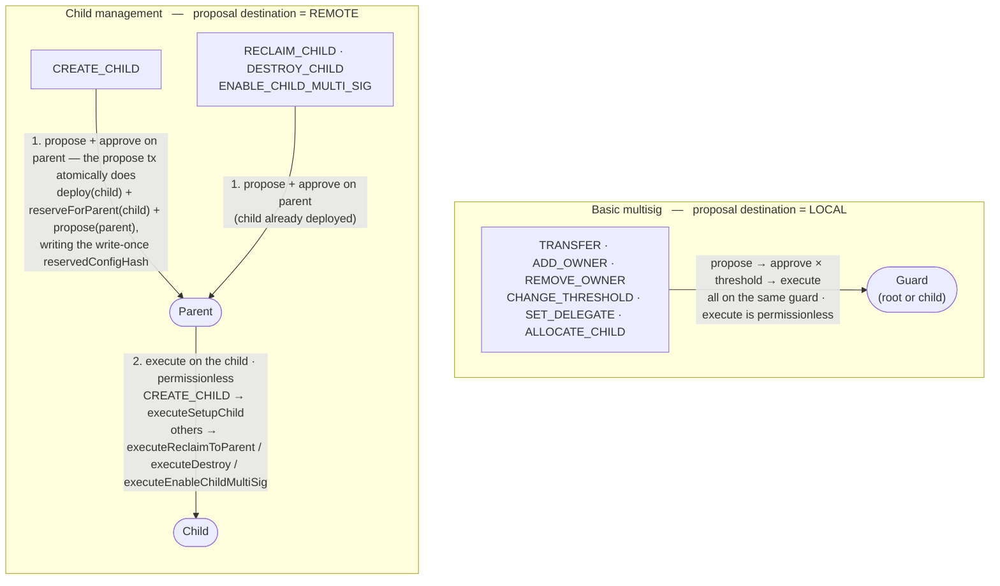

# Contracts (MinaGuard zkApp) — Architecture & Security Notes

This document describes the **on-chain contract** (`contracts/`) — the MinaGuard
zkApp built with o1js. It is the **trust anchor** of the whole system: every
other component (backend indexer, web UI, desktop shell, offline CLI) is
untrusted for integrity, and this circuit is what makes that safe.

It is the reference for the invariant map in
[`security-audit-guide.md`](./security-audit-guide.md); the clients that build
the structs this contract verifies are documented in
[`ui-audit-guide.md`](./ui-audit-guide.md) and
[`offline-audit-guide.md`](./offline-audit-guide.md).

---

## General overview

MinaGuard is a hierarchical multisig vault zkApp for Mina. It manages shared funds
via a quorum of owner signatures verified inside zero-knowledge circuits, and
supports a two-level parent/child guard hierarchy where a root guard can deploy,
fund, reclaim from, and destroy child guards. Children cannot themselves be parents.

All execution uses a **multi-step on-chain flow** (propose → approve → execute). A
proposal is either **LOCAL** (executes on the same guard that stored it) or **REMOTE**
(proposed/approved on a parent, executed on a specific child). Cross-contract
authorization is done by having the child read the parent's on-chain state as
AccountUpdate preconditions and verify an approval Merkle witness.

**What an owner actually signs is a single `Field` — the proposal hash.** Approvals
are keyed by `TransactionProposal.hash()`, and the contract re-hashes the caller-supplied
struct on-chain at approve and execute time. This is the mechanism that makes an untrusted
indexer safe: a client rebuilds the proposal from indexer data, hashes it locally, and
signs that hash; if the indexer lied about any field, the recomputed hash keys into a slot
that was never proposed and the transaction fails. The consequence — blind signing, where
the wallet shows only a hash — is the online path's central risk and is analyzed in
[`ui-audit-guide.md`](./ui-audit-guide.md).

## Architecture

### File layout

| File | Purpose |
| ---- | ------- |
| `MinaGuard.ts` | Contract class, types (structs), events |
| `constants.ts` | `MAX_OWNERS`, `MAX_RECEIVERS`, markers, `TxType` + `Destination` enums |
| `storage.ts` | Off-chain stores: `OwnerStore`, `ApprovalStore`, `VoteNullifierStore` |
| `list-commitment.ts` | Owner chain hash circuits: membership proof, add, remove, setup-list commitment + coherence |
| `memo.ts` | `memoToField()` (Poseidon hash of UTF-8 memo bytes), `decodeTxMemo()` (base58 tx memo → plaintext) |
| `utils.ts` | `ownerKey()` helper (`Poseidon.hash(owner.toFields())`) |
| `index.ts` | Public exports |

### On-chain state (13 fields)

MinaGuard declares 13 on-chain state fields — 14 field slots, since `parent` is a
two-field `PublicKey` — which exceeds the legacy 8-slot cap and requires the Mesa
32-slot branch of o1js:

| Slot | Field | Purpose |
| ---- | ----- | ------- |
| 0 | `ownersCommitment` | Chain hash of the ordered owner list |
| 1 | `threshold` | Minimum approvals required to execute any proposal |
| 2 | `numOwners` | Current owner count |
| 3 | `nonce` | Last executed LOCAL nonce on this guard |
| 4 | `voteNullifierRoot` | MerkleMap root preventing double-voting |
| 5 | `approvalRoot` | MerkleMap root of approval counts (`proposalHash → count`) |
| 6 | `configNonce` | Incremented on governance changes; invalidates stale proposals |
| 7 | `networkId` | Deployer-supplied network identifier |
| 8 | `parent` | Parent guard address (`PublicKey.empty()` for a root guard) |
| 9 | `parentNonce` | Last executed REMOTE nonce on this child (`0` on root guards) |
| 10 | `childExecutionRoot` | MerkleMap root marking REMOTE proposals executed on this child |
| 11 | `childMultiSigEnabled` | `Field(1)` if this child accepts its own propose/approve/execute ops, `Field(0)` otherwise |
| 12 | `reservedConfigHash` | Config hash committed by `reserveForParent` on a CREATE_CHILD child (`Field(0)` on root guards); `executeSetupChild` must initialize a config matching it |

### Owner storage model

Owners are stored as an **ordered list** off-chain. On-chain, a single commitment field
represents the entire list via a chain hash:

```
chain = Poseidon.hashWithPrefix('owner-chain', [])   // INITIAL_OWNER_CHAIN
for each owner in list:
  chain = Poseidon.hash([chain, owner.x, owner.isOdd.toField()])
```

This design means the full owner list is the witness, not a Merkle path. The witness
type is a fixed-size array:

```typescript
class OwnerWitness extends Struct({
  owners: Provable.Array(Option(PublicKey), MAX_OWNERS)  // MAX_OWNERS = 20
})
```

Active owners are `Some(pk)`, padding slots are `None`. Three circuit functions in
`list-commitment.ts` operate on this structure:

- **`assertOwnerMembership`** — Iterates the witness, recomputes the chain hash, checks that the claimed owner appears, and asserts the final chain equals `ownersCommitment`.
- **`addOwnerToCommitment`** — Inserts a new owner into the chain. Accepts an `insertAfter: Option(PublicKey)` parameter: `None` prepends, `Some(pk)` inserts after that key. Returns `[newChain, valid]`. Caller must check `valid` and enforce size bounds.
- **`removeOwnerFromCommitment`** — Rebuilds the chain while skipping the target owner. Returns `[newChain, valid]`. Caller must check `valid` and enforce `numOwners >= threshold`.

Two more circuit functions serve the setup path (`setup`, `reserveForParent`,
`executeSetupChild`), which takes a plain fixed-size `PublicKey[]`
(`SetupOwnersInput.owners`, `PublicKey.empty()` padding) rather than an `OwnerWitness`:

- **`computeSetupOwnersChain(owners, numOwners)`** — Folds the first `numOwners` slots into the chain hash, skipping padding. This is how the commitment is derived **on-chain** from the supplied owner list instead of being trusted as a caller argument. Canonical (base58) ordering is not enforced in-circuit — it is pinned implicitly wherever the result is bound to an approved commitment, since any reordering changes the hash.
- **`assertCoherentSetupOwners(owners, numOwners)`** — Companion coherence check: every inactive slot (index ≥ `numOwners`) must be `PublicKey.empty()`, and no two active slots may hold the same key (O(N²) pairwise check). Rejects a committed duplicate set like `[A, A]`, which a commitment-equality bind alone cannot catch.

### Off-chain storage

Three independent store classes in `storage.ts` mirror on-chain roots. Each is
self-contained and serializable.

**`OwnerStore`** — an ordered `PublicKey[]` array. Methods: `addSorted()`, `sortedPredecessor()`
(derives the `insertAfter` key for the add-owner flow), `insertAfter()`, `remove()`, `isOwner()`,
`getCommitment()` (computes chain hash), `getWitness()` (returns `OwnerWitness` padded to
`MAX_OWNERS`). Serializes via JSON with base58-encoded keys.

**`ApprovalStore`** — a `MerkleMap` keyed by `proposalHash`. The value encodes proposal
state with a marker offset:

| Value | Meaning |
| ----- | ------- |
| `Field(0)` | Not proposed (MerkleMap default) |
| `PROPOSED_MARKER` (1) | Proposed, 0 approvals |
| `PROPOSED_MARKER + N` | Proposed, N approvals |
| `EXECUTED_MARKER` (max field value) | Executed |

This encoding distinguishes "never proposed" from "proposed with 0 approvals", preventing
approval of fabricated proposals. Methods: `getCount()`, `setCount()`, `getWitness()`,
`isExecuted()`, `getRoot()`.

**`VoteNullifierStore`** — a `MerkleMap` keyed by
`Poseidon.hash([proposalHash, ...approver.toFields()])`. Value is `Field(0)` (not voted)
or `Field(1)` (voted). Prevents the same owner from approving the same proposal twice.
Methods: `isNullified()`, `nullify()`, `getWitness()`, `getRoot()`.

### Proposal structure

```typescript
class Receiver extends Struct({
  address: PublicKey,
  amount:  UInt64,
})

class TransactionProposal extends Struct({
  receivers:    Provable.Array(Receiver, MAX_RECEIVERS),  // Fixed-size array of recipients
  tokenId:      Field,       // Token ID (Field(0) for MINA)
  txType:       Field,       // TxType value
  data:         Field,       // Context-dependent payload (see below)
  memoHash:     Field,       // Poseidon hash of the memo bytes (memoToField); bound into hash()
  nonce:        Field,       // Ordered execution nonce (LOCAL or child-REMOTE domain)
  configNonce:  Field,       // Must match on-chain configNonce
  expirySlot:   Field,       // Global slot deadline (0 = no expiry)
  networkId:    Field,       // Must match on-chain networkId
  guardAddress: PublicKey,   // Must match the guard the proposal lives on
  destination:  Field,       // LOCAL or REMOTE (see below)
  childAccount: PublicKey,   // Target child for REMOTE; empty for LOCAL
})
```

Unused receiver slots use `Receiver.empty()` (`PublicKey.empty()` + `UInt64(0)`).
Non-transfer proposals (governance, child-lifecycle) use all-empty receiver slots unless
otherwise noted.

`hash()` returns `Poseidon` over **every** field of the struct — including `memoHash`, which is
how the proposal's memo is bound in (the plaintext itself travels off-chain as the transaction
memo; see the [backend memo lifecycle](./backend-audit-guide.md#data-model)). This hash is the
universal key for approval counts, vote nullifiers, and signatures. Because `guardAddress`,
`destination`, and `childAccount`
are all inside the hash, a proposal is cryptographically bound to a specific (parent, child)
pair — cross-child reuse produces a different hash.

**Hash-keyed approvals with ordered execution nonces.** Approvals remain keyed by the full
proposal hash, not by nonce. That preserves content binding: owners approve an exact proposal
payload, not just a nonce slot. The `nonce` field serves a different purpose — it orders
execution and lets a later approved proposal invalidate an earlier unexecuted proposal that
shares the same nonce. Execution domains:

- **LOCAL proposals** use the guard's `nonce`.
- **REMOTE proposals** use the target child's `parentNonce`.
- **`CREATE_CHILD`** is a special REMOTE case: its `nonce` must be `0`, and `executeSetupChild` initializes the child with `nonce = 1` and `parentNonce = 1`.

**LOCAL vs REMOTE proposals.**

| `destination` | Flow | Example txTypes |
| ------------- | ---- | --------------- |
| `LOCAL` | Proposed, approved, and executed on the same guard | `TRANSFER`, `ADD_OWNER`, `REMOVE_OWNER`, `CHANGE_THRESHOLD`, `SET_DELEGATE`, `ALLOCATE_CHILD` |
| `REMOTE` | Proposed and approved on the **parent**, executed on the **child** named in `childAccount` | `CREATE_CHILD`, `RECLAIM_CHILD`, `DESTROY_CHILD`, `ENABLE_CHILD_MULTI_SIG` |

REMOTE proposals are never marked executed on the parent's `approvalRoot` — the parent never
runs an execute method for them. Replay protection lives on the child in `childExecutionRoot`.

**TxType enum and `data` field usage.**

| TxType | Value | `destination` | `data` contains | `receivers[0]` contains |
| ------ | ----- | ------------- | --------------- | ----------------------- |
| `TRANSFER` | 0 | `LOCAL` | `Field(0)` | Any recipient (multi-slot allowed) |
| `ADD_OWNER` | 1 | `LOCAL` | `Field(0)` | The owner pubkey to add |
| `REMOVE_OWNER` | 2 | `LOCAL` | `Field(0)` | The owner pubkey to remove |
| `CHANGE_THRESHOLD` | 3 | `LOCAL` | New threshold value | Empty |
| `SET_DELEGATE` | 4 | `LOCAL` | `Field(0)` | Delegate pubkey (empty = undelegate to self) |
| `CREATE_CHILD` | 5 | `REMOTE` | `Poseidon([ownersCommitment, threshold, numOwners])` of the child's initial config | Empty |
| `ALLOCATE_CHILD` | 6 | `LOCAL` | `Field(0)` | Any child recipient (multi-slot allowed) |
| `RECLAIM_CHILD` | 7 | `REMOTE` | Amount to reclaim | Empty |
| `DESTROY_CHILD` | 8 | `REMOTE` | `Field(0)` | Empty |
| `ENABLE_CHILD_MULTI_SIG` | 9 | `REMOTE` | `0` or `1` | Empty |

Propose-time rules enforced in `propose()`:
- `receivers[0]` must be non-empty for `ADD_OWNER`/`REMOVE_OWNER`.
- `receivers[0]` must be empty for `CHANGE_THRESHOLD`.
- Only `TRANSFER` and `ALLOCATE_CHILD` may use more than one receiver slot.
- `data` must be `Field(0)` unless txType is `CHANGE_THRESHOLD`, `CREATE_CHILD`, `RECLAIM_CHILD`, or `ENABLE_CHILD_MULTI_SIG`.
- `destination` and `childAccount` must be consistent: REMOTE requires a non-empty `childAccount`, LOCAL requires an empty one. For REMOTE, `guardAddress` must be the parent.
- `nonce` must be fresh for the relevant execution domain:
  - LOCAL propose/approve requires `proposal.nonce > this.nonce`
  - REMOTE propose/approve requires `proposal.nonce > child.parentNonce`
  - `CREATE_CHILD` requires `proposal.nonce == 0`

### Constants

Defined in `constants.ts`:

| Constant | Value | Purpose |
| -------- | ----- | ------- |
| `MAX_RECEIVERS` | `9` | Fixed-size bound for receiver arrays in proposals. Hard cap from Mina's transaction cost budget — 10 receivers fails proving with "transaction is too expensive" |
| `MAX_OWNERS` | `20` | Fixed-size bound for owner witnesses |
| `INITIAL_OWNER_CHAIN` | `Poseidon.hashWithPrefix('owner-chain', [])` | Chain hash seed for owners |
| `PROPOSED_MARKER` | `Field(1)` | Base value written to approval map on propose |
| `EXECUTED_MARKER` | `Field(0).sub(1)` | Max field value; marks executed LOCAL proposals |
| `EMPTY_MERKLE_MAP_ROOT` | `new MerkleMap().getRoot()` | Initializes `approvalRoot`, `voteNullifierRoot`, `childExecutionRoot` |

### On-chain multi-step flow

**Deploy.** `deploy()` sets account permissions (see [Permissions](#permissions)) and emits
a `DeployEvent` with the contract address for indexer discovery.

**Setup.** `setup(threshold, numOwners, networkId, initialOwners)` — one-time root-guard
initialization.

- Guard: `ownersCommitment == Field(0)` (not yet initialized)
- Computes `ownersCommitment` **on-chain** from `initialOwners` via `computeSetupOwnersChain`, after `assertCoherentSetupOwners` rejects non-empty padding slots and duplicate active owners
- Validates: `threshold > 0`, `numOwners >= threshold`, `numOwners <= MAX_OWNERS`
- Initializes the guard state: `nonce = 0`, `parentNonce = 0`, `approvalRoot`, `voteNullifierRoot`, `childExecutionRoot` set to `EMPTY_MERKLE_MAP_ROOT`; `parent = PublicKey.empty()`; `childMultiSigEnabled = Field(1)` (`reservedConfigHash` is untouched — `Field(0)` on a root guard)
- Emits `SetupEvent` + one `SetupOwnerEvent` per `MAX_OWNERS` slot
- Trust model: because the commitment is derived in-circuit from the same owner list that is emitted in events, the stored anchor and the announced owner set cannot diverge — the deployer cannot store a commitment that disagrees with the owner set, and no client-side cross-check is required

**Propose (with auto-approve).**
`propose(proposal, ownerWitness, proposer, signature, voteNullifierWitness, approvalWitness)`
— there is only one propose method and it **always auto-approves** as the proposer's first vote:

1. Assert `childMultiSigEnabled == 1` if this is a child guard
2. Verify proposer is an owner (chain hash witness)
3. Assert `configNonce`, `networkId`, `guardAddress` match on-chain values
4. Assert `destination` and `childAccount` are consistent
5. Assert proposal nonce freshness for the relevant domain (`nonce` or `parentNonce`; `CREATE_CHILD` requires `0`)
6. Enforce per-txType propose rules (see TxType table)
7. Verify proposer's signature over `[proposalHash]`
8. Check and set vote nullifier (prevents re-proposal)
9. Assert approval slot is empty (`Field(0)`), then write `PROPOSED_MARKER + 1`
10. Emit `ProposalEvent`, `MAX_RECEIVERS` `ReceiverEvent`s, and `ApprovalEvent`

**Approve.**
`approveProposal(proposal, signature, approver, ownerWitness, approvalWitness, currentApprovalCount, voteNullifierWitness)`

1. Assert `childMultiSigEnabled == 1` if this is a child guard
2. Verify approver is an owner
3. Assert `configNonce`, `networkId`, `guardAddress` match
4. Assert proposal nonce freshness for the relevant domain
5. Verify signature over `[proposalHash]`
6. Assert proposal exists (`count >= PROPOSED_MARKER`) and not executed
7. Check and set vote nullifier
8. Increment approval count in the approval map
9. Emit `ApprovalEvent`

**Execute — LOCAL methods.** All LOCAL execute methods share these checks:

- Wallet initialized (`ownersCommitment != 0`)
- `childMultiSigEnabled == 1` if this is a child guard
- `txType` matches the method, `destination == LOCAL`
- `configNonce`, `networkId`, `guardAddress` match on-chain
- `proposal.nonce == this.nonce + 1`
- Proposal not expired (if `expirySlot != 0`, asserts `globalSlotSinceGenesis <= expirySlot`)
- Not executed, exists, and threshold satisfied
- Approval witness verified against `approvalRoot`

After execution the contract increments `nonce` and overwrites the approval count with
`EXECUTED_MARKER`, permanently preventing re-execution or further approvals. Execution is
**permissionless** — anyone can trigger it once the threshold is met.

- **`executeTransfer`** — Loops through all receiver slots, sending to each non-empty one. Empty slots are converted into zero-value self-sends so they have no effect on balances. Emits `ExecutionEvent`.
- **`executeAllocateToChildren`** — Same structure as `executeTransfer` but asserts `txType == ALLOCATE_CHILD`. Typically sends MINA from a parent to its children. Emits `ExecutionEvent { txType: ALLOCATE_CHILD }`. The indexer distinguishes allocations from generic transfers by txType.
- **`executeOwnerChange`** — Handles both `ADD_OWNER` and `REMOVE_OWNER` via boolean flags. The owner pubkey is read from `receivers[0]`. Runs both `addOwnerToCommitment` and `removeOwnerFromCommitment` circuits and selects the correct result based on `txType`. Asserts `newNumOwners >= threshold` and `<= MAX_OWNERS`. Updates `ownersCommitment` and `numOwners`. Increments `configNonce`. Emits `ExecutionEvent` + `OwnerChangeEvent`.
- **`executeThresholdChange`** — Validates `proposal.data == newThreshold`, `newThreshold > 0`, `numOwners >= newThreshold`. Updates `threshold`. Increments `configNonce`. Emits `ExecutionEvent` + `ThresholdChangeEvent`.
- **`executeDelegate`** — Reads the target delegate from `receivers[0]` (empty slot = undelegate to self). Sets `account.delegate`. Does **not** increment `configNonce`. Emits `ExecutionEvent` + `DelegateEvent`.

### Subaccounts / child lifecycle



*LOCAL proposals run their whole lifecycle on one guard (a root **or** a child that has
`childMultiSigEnabled`). Child-management proposals are REMOTE: proposed and approved on the
parent, executed on the named child. `CREATE_CHILD` is the special case — its propose
transaction also deploys and reserves the child (see `reserveForParent` below); the hierarchy
is capped at two levels, so children cannot raise REMOTE proposals of their own.*

A child guard is a separate MinaGuard contract instance whose `parent` state field points
to another MinaGuard. Child-lifecycle operations (`CREATE_CHILD`, `RECLAIM_CHILD`,
`DESTROY_CHILD`, `ENABLE_CHILD_MULTI_SIG`) are REMOTE proposals: proposed and approved on the
parent, executed on the child.

The hierarchy is capped at **two levels** (root → child). `propose` asserts that REMOTE
proposals (which include `CREATE_CHILD`) can only be raised on a guard whose
`parent == PublicKey.empty()` — so only root guards can spawn children, and children cannot
themselves become parents.

**Cross-contract precondition model.** When the child runs a REMOTE execute method, it reads
the parent's on-chain state via:

```typescript
const parentGuard = new MinaGuard(parentAddress);
const parentOwnersCommitment = parentGuard.ownersCommitment.getAndRequireEquals();
const parentConfigNonce      = parentGuard.configNonce.getAndRequireEquals();
const parentNetworkId        = parentGuard.networkId.getAndRequireEquals();
const parentApprovalRoot     = parentGuard.approvalRoot.getAndRequireEquals();
const parentThreshold        = parentGuard.threshold.getAndRequireEquals();
```

Each `getAndRequireEquals()` call pins the parent's state as an AccountUpdate precondition. If
any parent field changes between approval and execution (e.g. an `executeOwnerChange` bumps
`configNonce`), the precondition fails and the child transaction aborts atomically. The child
then verifies a Merkle witness proving the REMOTE proposal reached threshold on
`parentApprovalRoot`.

**Child execution replay guard.** REMOTE proposals never touch the parent's `approvalRoot` —
the parent never runs an execute method for them, so `markExecuted` is not called. Instead,
each child maintains its own `childExecutionRoot` MerkleMap. When a child runs a REMOTE execute
method, it asserts the proposal's slot in `childExecutionRoot` is `Field(0)` and then writes
`EXECUTED_MARKER` via `markChildExecuted`. This is the sole replay guard for REMOTE flows.
Cross-child safety: because `proposalHash` includes `childAccount`, a REMOTE proposal for child
A produces a different hash than one for child B even with otherwise identical fields — and each
child asserts `proposal.childAccount == this.address`.

**`reserveForParent`.**
`reserveForParent(parentAddress, proposalHash, threshold, numOwners, initialOwners)` runs on the
**child** contract in the same transaction as `deploy()` + parent `propose()` for a `CREATE_CHILD`
proposal. Sets `this.parent` to the parent address, stores
`reservedConfigHash = Poseidon([ownersCommitment, threshold, numOwners])` over the
on-chain-computed commitment (write-once — a second reserve is blocked by the `parent == empty`
guard), and emits `CreateChildConfigEvent` + 20 `CreateChildOwnerEvent`s on-chain so the child's
intended owner list is publicly available before `executeSetupChild` runs. (The indexer stores
these as raw events but does not parse them; the UI and offline CLI fetch and parse them directly.)

- **Why this method exists:** `executeSetupChild` requires the child's owner list and threshold as arguments. Without `reserveForParent`, the `ProposalEvent` only contains a `data` hash (`Poseidon([ownersCommitment, threshold, numOwners])`) — the individual owner addresses are not recoverable from the hash. By emitting the full owner list on the child at propose time, any user can retrieve the config from on-chain events and execute `setupChild` without coordinating with the proposer.
- **Anti-front-running:** Setting `this.parent` at propose time prevents attackers from calling `setup()` on the uninitialized child between deploy and execute. `setup()` asserts `this.parent == PublicKey.empty()`, which fails once `reserveForParent` has run. `executeSetupChild` verifies `this.parent == proposal.guardAddress`, ensuring only the designated parent can initialize the child.

Guards:
- **Uninitialized only**: asserts `this.ownersCommitment == 0` — prevents calling on already-set-up contracts (which would let an attacker bind a live root vault to a hostile parent).
- **One-time only**: asserts `this.parent == PublicKey.empty()` — cannot be called twice.
- **Non-empty parent**: asserts `parentAddress != PublicKey.empty()`.

No owner authentication is needed because the child address comes from a freshly generated keypair
whose private key is required to sign the deploy account update in the same transaction. An attacker
cannot deploy or reserve the child without the private key.

The announced config is provably coherent: `reserveForParent` runs `assertCoherentSetupOwners` and
computes the emitted `ownersCommitment` on-chain from `initialOwners` via `computeSetupOwnersChain`,
so the `CreateChildConfigEvent`/`CreateChildOwnerEvent`s can never carry a commitment that disagrees
with the owner list they announce. What is *not* checked at reserve time is the binding to the parent
proposal's `data` hash — a proposer could still sign a `proposal.data` that differs from the reserved
config. That mismatch is caught at execute time: `executeSetupChild` recomputes the config hash from
the supplied owner list and asserts it equals **both** `proposal.data` and the stored
`reservedConfigHash`. A mismatched proposal can be approved by honest owners, but it can never
execute — and the executor cannot initialize any config other than the one the reserve-time events
displayed. Both the UI worker (`executeSetupChildOnchain`) and the offline CLI (`handleExecute` for
createChild) additionally validate the announced config before building the execute transaction; the
transaction detail page runs the same comparison at approval time and warns approvers when the
announced config doesn't hash to the signed `proposal.data`.

**Child lifecycle methods.** All four child-lifecycle `@method`s run on the child, take
parent-approval inputs `(parentApprovalWitness, parentApprovalCount)`, and emit `ExecutionEvent`
alongside their specific event.

- **`executeSetupChild(threshold, numOwners, initialOwners, proposal, parentApprovalWitness, parentApprovalCount)`** — Called on a child that was already deployed and reserved (via `reserveForParent`) at propose time but not yet fully initialized. Computes `ownersCommitment` on-chain from `initialOwners` (with `assertCoherentSetupOwners`), then asserts `this.parent == proposal.guardAddress` (verifying the reservation matches), `txType == CREATE_CHILD`, `destination == REMOTE`, `proposal.childAccount == this.address`, `proposal.nonce == 0`, and that `Poseidon([ownersCommitment, threshold, numOwners])` equals **both** `proposal.data` and the `reservedConfigHash` stored at reserve time. Uses `proposal.networkId` as the child's `networkId` — `assertParentApprovalState` pins the parent's `networkId` as an AccountUpdate precondition, so `proposal.networkId` is the parent-approved value and an attacker can't supply a mismatched id via this path. Initializes all state with `nonce = 1` and `parentNonce = 1`, emits `SetupEvent`, `SetupOwnerEvent`s, `ExecutionEvent`, `CreateChildEvent`.
- **`executeReclaimToParent(proposal, parentApprovalWitness, parentApprovalCount, childExecutionWitness, amount)`** — Sends `amount` MINA back to `this.parent`. Asserts `proposal.data == amount.value`, `proposal.nonce == this.parentNonce + 1`, increments `parentNonce`, and marks the proposal in `childExecutionRoot`. Emits `ExecutionEvent` + `ReclaimChildEvent { proposalHash, parentAddress, amount }`. Does **not** check `childMultiSigEnabled` — this is a deliberate recovery path that works even when the child is disabled.
- **`executeDestroy(proposal, parentApprovalWitness, parentApprovalCount, childExecutionWitness)`** — Sends the full child balance to the parent, sets `childMultiSigEnabled = 0`, increments `parentNonce`, and marks the proposal in `childExecutionRoot`. The child can later be re-enabled by `executeEnableChildMultiSig`; nonce state is preserved across disable/enable cycles. Reuses `ReclaimChildEvent` (same "MINA flowed child → parent" semantics — `ExecutionEvent.txType == DESTROY_CHILD` disambiguates from a partial reclaim).
- **`executeEnableChildMultiSig(proposal, parentApprovalWitness, parentApprovalCount, childExecutionWitness, enabled)`** — Asserts `proposal.data == enabled`, `enabled ∈ {0, 1}`, and `proposal.nonce == this.parentNonce + 1`. Sets `childMultiSigEnabled`, increments `parentNonce`, and marks the proposal in `childExecutionRoot`. Emits `ExecutionEvent` + `EnableChildMultiSigEvent { proposalHash, parentAddress, enabled }`.

### Events

All event structs are defined in `MinaGuard.ts` and registered on `this.events`. Fields are
slimmed: per-execution events carry only what is **not** already derivable from propose-time
`ProposalEvent`/`ReceiverEvent`s for the same `proposalHash`.

| Event | Fields | Emitted By |
| ----- | ------ | ---------- |
| `DeployEvent` | `guardAddress` | `deploy` |
| `SetupEvent` | `ownersCommitment, threshold, numOwners, networkId, parent` | `setup`, `executeSetupChild` |
| `SetupOwnerEvent` | `owner, index` | `setup`, `executeSetupChild` (one per `MAX_OWNERS` slot) |
| `ProposalEvent` | `proposalHash, proposer, tokenId, txType, data, memoHash, nonce, configNonce, expirySlot, networkId, guardAddress, destination, childAccount` | `propose` |
| `ReceiverEvent` | `proposalHash, receiver, amount` | `propose` (one per `MAX_RECEIVERS` slot) |
| `ApprovalEvent` | `proposalHash, approver, approvalCount` | `propose`, `approveProposal` |
| `ExecutionEvent` | `proposalHash, txType` | all LOCAL and REMOTE execute methods |
| `OwnerChangeEvent` | `proposalHash, owner, added, newNumOwners, configNonce` | `executeOwnerChange` (`owner` = the added/removed key; `added` = `1` for ADD_OWNER, `0` for REMOVE_OWNER) |
| `ThresholdChangeEvent` | `proposalHash, oldThreshold, newThreshold, configNonce` | `executeThresholdChange` |
| `DelegateEvent` | `proposalHash, delegate` | `executeDelegate` (empty `delegate` = undelegate to self) |
| `CreateChildConfigEvent` | `proposalHash, childAccount, ownersCommitment, threshold, numOwners` | `reserveForParent` on child (one per `CREATE_CHILD` propose) |
| `CreateChildOwnerEvent` | `proposalHash, owner, index` | `reserveForParent` on child (one per `MAX_OWNERS` slot) |
| `CreateChildEvent` | `proposalHash, parentAddress` | `executeSetupChild` (config fields duplicated in the sibling `SetupEvent`) |
| `ReclaimChildEvent` | `proposalHash, parentAddress, amount` | `executeReclaimToParent`, `executeDestroy` |
| `EnableChildMultiSigEvent` | `proposalHash, parentAddress, enabled` | `executeEnableChildMultiSig`, `executeDestroy` (destroy emits this with `enabled: 0` so a single event carries the state flip for both flows) |

**Indexer reconstruction.** Every contract state field is reconstructable from events alone — no
on-chain state reads required. The mechanics of that reconstruction (the append-only tables, the
parent-walk for REMOTE executions) live in
[`backend-audit-guide.md`](./backend-audit-guide.md#data-model). In brief:

- **LOCAL proposal lifecycle:** `ProposalEvent` → `ApprovalEvent`(s) → `ExecutionEvent` (with the corresponding governance sibling event) on the same guard.
- **REMOTE proposal lifecycle:** `ProposalEvent` on the parent → `ApprovalEvent`(s) on the parent → `ExecutionEvent` on the **child**. `applyExecutionEvent` marks the parent's `Proposal` row executed by trying `(emittingContractId, proposalHash)` first and, on a miss, walking the child's `Contract.parent` field to retry against the parent's contractId.
- **`Contract.parent`** populated from `SetupEvent.parent` (empty for root, real parent for child).
- **`Contract.childMultiSigEnabled`** initialized `true` at `SetupEvent`. Flipped on `EnableChildMultiSigEvent` by reading `event.enabled` directly; `executeDestroy` emits the same event with `enabled: 0`, so a single indexer handler covers both flows.

### Permissions

Set in `deploy()`:

| Permission | Value | Rationale |
| ---------- | ----- | --------- |
| `editState` | `proof()` | State changes only via proven contract methods |
| `send` | `proof()` | Outgoing transfers only via proven contract methods |
| `receive` | `none()` | Anyone can deposit MINA without a proof |
| `setDelegate` | `proof()` | Delegation only via proven contract methods |
| `setPermissions` | `impossible()` | Prevents permission downgrade attacks |
| `setVerificationKey` | `impossibleDuringCurrentVersion()` | Pins the verification key for the lifetime of the current version |
| `setZkappUri` | `impossible()` | Metadata cannot be rewritten |
| `setTokenSymbol` | `impossible()` | Token symbol cannot be rewritten |
| `incrementNonce` | `impossible()` | Proof-authorized AUs don't set a nonce precondition |
| `setVotingFor` | `impossible()` | Not used |
| `setTiming` | `impossible()` | Not used |

All other permissions use `Permissions.default()`. The one-shot deploy key that sets these is
**powerless afterward**: every state/fund knob requires a proof and every permission knob is
`impossible`, so a leaked deploy key has no post-deploy authority (this is what makes the UI's
in-browser ephemeral key safe — see [`ui-audit-guide.md`](./ui-audit-guide.md) focus point 5).

---

## Threat model & assumptions

The contract is the **trust anchor**: it assumes nothing about the indexer, the UI, the network
transport, or the executor's honesty, and it enforces every fund-safety invariant itself. The
assumptions it *does* rest on:

- **o1js / `mina-signer` correctness.** Poseidon hashing, the proof system, and signature
  verification are trusted primitives (see [Dependencies](#dependencies)). The signing path and the
  proving path must agree on encoding — that identity is re-checked whenever the `deps/o1js`
  submodule or the o1js pin moves.
- **The deployer's genesis choices.** The initial owner set and `networkId` are the deployer's to
  choose; the contract only guarantees the stored commitment cannot disagree with the announced
  owner list (see [Setup](#on-chain-multi-step-flow)). Depositors verify setup events first.
- **Mina's finality horizon.** Replay/precondition guarantees are on-chain and absolute; the
  *display* of them via the indexer inherits Mina's ~290-block reorg horizon (an availability
  concern owned by the backend, not a fund-safety one).

### Suggested focus points

**1. Proposal-hash binding is the whole game.** Every approval and execution keys into
`TransactionProposal.hash()`, recomputed on-chain from the caller-supplied struct, and the
approver's signature must cover that exact hash (`signature.verify(owner, [proposalHash])`).
Audit whether any field that affects fund movement — `receivers`, `data`, `guardAddress`,
`destination`, `childAccount`, `networkId` — is left out of the hash or of the propose-time
consistency checks. Anything omitted becomes malleable after approval.

**2. Replay guards across all four domains.** LOCAL re-execution is blocked by `EXECUTED_MARKER`
in `approvalRoot`; REMOTE by `childExecutionRoot`; cross-contract by `guardAddress` in the hash;
cross-child by `childAccount` in the hash plus the child's `childAccount == this.address` assert;
cross-network by the compile-time `NETWORK_DOMAIN` baked into the VK *and* the `networkId` field
check. Confirm each execute path writes its marker and that no path can execute twice or on the
wrong guard/child/network.

**3. Child reservation and config binding (PR #89).** The gap between `deploy(child)` and
`executeSetupChild` is a hijack window closed by `reserveForParent` (write-once `parent` +
`reservedConfigHash`). Verify: `setup()` is blocked once reserved, `executeSetupChild` can only
initialize the double-bound config (`proposal.data` **and** `reservedConfigHash`), and the child's
`networkId` is forced to the parent-approved value via the precondition.

**4. Governance bounds cannot lock or unbound the vault.** `setup()`, `executeOwnerChange()`, and
`executeThresholdChange()` all re-assert `0 < threshold ≤ numOwners ≤ MAX_OWNERS`. Confirm no
sequence of owner/threshold changes can drive threshold above the owner count (permanent lock) or
past `MAX_OWNERS` (circuit-size overflow).

**5. Permissions and VK immutability.** `deploy()` sets `setPermissions: impossible()` and
`setVerificationKey: impossibleDuringCurrentVersion()`. Confirm there is no method path that
re-authorizes state/fund movement outside a proof, and that the deployed VK matches the pinned
`contracts/.vk-hash` (the `check-vk-hash` CI job enforces this per network).

## Security properties

| Property | Mechanism |
| -------- | --------- |
| Only owners can propose | Chain hash witness verified against `ownersCommitment` |
| Only owners can approve | Chain hash witness + signature over `proposalHash` |
| No double-voting | Vote nullifier map keyed by `hash(proposalHash, approver)` |
| Proposal existence verified | `PROPOSED_MARKER` in approval map |
| No LOCAL re-execution | `EXECUTED_MARKER` replaces count after execution |
| No REMOTE re-execution | `EXECUTED_MARKER` written to child's `childExecutionRoot` |
| Stale proposals rejected | `configNonce` in proposal must match on-chain value |
| Time-bounded proposals | Optional `expirySlot` checked against `globalSlotSinceGenesis` |
| No proposal substitution | Approvals keyed by content hash, not sequential ID |
| Setup owner list coherent with commitment | `ownersCommitment` computed in-circuit from `initialOwners` (`computeSetupOwnersChain`); non-empty padding and duplicate active owners rejected (`assertCoherentSetupOwners`) |
| Executed child config matches the displayed config | `reserveForParent` stores `reservedConfigHash` (write-once); `executeSetupChild` asserts the recomputed config hash equals both `proposal.data` and `reservedConfigHash` |
| Cross-network replay prevented | compile-time `NETWORK_DOMAIN` (Field(1) mainnet / Field(2) testnet) baked into every proposal hash produces distinct VKs per network; additionally `networkId` in proposal must match on-chain state |
| Cross-contract replay prevented | `guardAddress` in proposal must match `this.address` |
| Cross-child replay prevented | `childAccount` is inside `proposalHash`; children assert `proposal.childAccount == this.address` |
| Parent state drift invalidates REMOTE approvals | Child reads `configNonce`/`ownersCommitment`/`approvalRoot`/`threshold` as AccountUpdate preconditions; any parent change aborts the child tx |
| Child reserved at deploy time | `reserveForParent()` asserts `ownersCommitment == 0` and `parent == empty`, then sets `this.parent` atomically with deploy — blocking `setup()` hijack, attacker-parent binding, and reservation of initialized root vaults |
| Hierarchy depth capped at 2 | `propose` rejects REMOTE proposals on any guard whose `parent != PublicKey.empty()`, so children can never raise `CREATE_CHILD` |
| Vault cannot be locked | Remove-owner asserts `newNumOwners >= threshold` |
| Reclaim and destroy are recovery paths | Child-lifecycle methods bypass `childMultiSigEnabled`; the parent can always retrieve funds |
| Anyone can execute | Execution is permissionless once threshold is met |
| MINA receivable | `receive: Permissions.none()` allows deposits without proof |
| State changes proof-only | `editState: Permissions.proof()` — no signature fallback |
| Permission downgrade prevented | `setPermissions: Permissions.impossible()` |
| Verification key immutable | `setVerificationKey: impossibleDuringCurrentVersion` |
| Bounded circuit size | `MAX_OWNERS = 20`, `MAX_RECEIVERS = 9` |

## UI model

The Next.js UI under `ui/` drives the contract through three pages (full UI threat model in
[`ui-audit-guide.md`](./ui-audit-guide.md)):

- `/` — flat-level account list, but renders as an **indented tree** when subaccounts exist. Visibility rule is "full subtree": if the connected wallet owns any node in a tree, the page renders the entire tree (root + every descendant) — even sibling children the user doesn't own. Trees with no owned node are hidden. Built client-side from the `parent` pointer on every `Contract` row returned by `GET /api/contracts`.
- `/accounts/[address]` — detail dashboard: stat cards, parent + subaccounts cards, propose-button rows, recent proposals.
- `/accounts/new` — Safe-style two-step wizard. Adding `?parent=<address>` switches the wizard into subaccount-creation mode (network locked to parent, submit becomes "Propose subaccount" rather than direct deploy).

**Propose-button gating matrix.**

| Page is… | Wallet is owner | `childMultiSigEnabled` | Local actions (`LOCAL_TX_TYPES`) | Subaccount actions (`CHILD_TX_TYPES`) |
|---|---|---|---|---|
| Root | yes | n/a | enabled | enabled (all 5: create / allocate / reclaim / destroy / toggle) |
| Root | no | n/a | disabled (tooltip: "Not an owner") | disabled |
| Child | yes | true | enabled | hidden — children don't manage further subaccounts |
| Child | yes | false | disabled (tooltip: "Multi-sig disabled by parent") | hidden |
| Child | no | any | disabled | hidden |

Disabled buttons are rendered greyed-out with a tooltip rather than removed, so the user always
sees what actions exist and why they're locked.

**CREATE_CHILD two-transaction flow.** Deploying a subaccount requires two separate Mina
transactions:

1. **Propose + Deploy** — `/accounts/new?parent=…` generates a fresh keypair for the child, deploys the child contract, computes `Poseidon.hash([ownersCommitment, threshold, numOwners])` for the proposal `data`, and submits a `CREATE_CHILD` REMOTE proposal to the parent via the parent's `propose()`. The child contract is deployed in this step but left uninitialized (`ownersCommitment == 0`). The child config (owners, threshold, address) is persisted to `localStorage` keyed by `<parentAddress>:<childAddress>`.
2. **Execute** — once the parent's CREATE_CHILD proposal has reached threshold approvals, any user can execute it from the `/transactions/[id]` page. Execution calls `executeSetupChild` on the already-deployed child address, initializing it with the approved config and binding it to the parent.

`localStorage` records are auto-pruned once the child's `SetupEvent` has been indexed. The
security of the gap between the two transactions rests on `reserveForParent` (see
[Subaccounts / child lifecycle](#subaccounts--child-lifecycle)); the UI must never be inducible to
deploy a child *without* the atomic `reserveForParent`.

**Offline signing support for CREATE_CHILD.** The offline CLI supports all three phases (details in
[`offline-audit-guide.md`](./offline-audit-guide.md)):

- **Propose** — the bundle includes a `childPrivateKey` field with the freshly generated child keypair; the CLI deploys the child and submits `propose()` in one transaction, signing the child's deploy account update with the bundled key.
- **Approve** — standard approval flow; the bundle includes the child account snapshot so the CLI can read `parentNonce` for nonce freshness.
- **Execute** — the bundle includes the child account snapshot and child events; the CLI calls `executeSetupChild` on the already-deployed child. No child private key needed at this stage.

**REMOTE proposal execution routing.** `/transactions/[id]`'s execute button dispatches on
`proposal.destination` + `proposal.txType`:

- `destination === 'local'` → `executeProposalOnchain` (calls `executeTransfer`/`executeOwnerChange`/`executeThresholdChange`/`executeDelegate`/`executeAllocateToChildren` on the parent).
- `destination === 'remote'` and `txType ∈ {reclaimChild, destroyChild, enableChildMultiSig}` → `executeChildLifecycleOnchain` (calls the matching `execute*` method on the **child** guard, with parent approval witness + child execution witness assembled client-side from indexed events).
- `txType === 'createChild'` → `executeSetupChildOnchain` (calls `executeSetupChild` on the child, with parent approval witness. Any user can trigger this once threshold is met).

---

## File tree

```
contracts/
├── src/
│   ├── MinaGuard.ts            # Contract class, @method definitions, structs, events —
│   │                           #   the enforcement layer. THE file for fund-safety review
│   ├── constants.ts            # MAX_OWNERS / MAX_RECEIVERS, markers, TxType + Destination
│   ├── storage.ts              # Off-chain OwnerStore / ApprovalStore / VoteNullifierStore
│   ├── list-commitment.ts      # Owner chain-hash circuits: membership, add, remove,
│   │                           #   computeSetupOwnersChain + assertCoherentSetupOwners
│   ├── memo.ts                 # memoToField (Poseidon hash) + decodeTxMemo (base58 parse)
│   ├── utils.ts                # ownerKey() helper
│   ├── index.ts                # Public exports (consumed by ui/ and offline-cli/)
│   └── tests/                  # Invariant coverage — the "Primary tests" column of the map
│       ├── propose.test.ts     approve.test.ts     execute.test.ts
│       ├── governance.test.ts  child.test.ts       setup.test.ts
│       ├── delegate.test.ts    memo.test.ts        list-commitment.test.ts
│       ├── storage.test.ts     test-helpers.ts
│
└── .vk-hash                    # Canonical VK hashes (testnet= / mainnet=); check-vk-hash CI
                                #   recompiles both and fails on drift
```

---

## Dependencies

- **`o1js` (`3.0.0-mesa.final`, hoisted at the repo root)** — the proving system, zkApp runtime,
  and hashing/signature primitives (Poseidon, `Signature.verify`). This is the cryptographic
  foundation of the TCB. The **Mesa** branch is required specifically because MinaGuard's 13 state
  fields exceed o1js's legacy 8-slot cap. The circuit's correctness assumptions are o1js's
  correctness assumptions.
- **`mina-signer`** — used by the clients (UI worker, offline CLI) that build and sign the structs
  this contract verifies, resolved from the pinned `ui/deps/o1js` submodule. It is **not** a
  contract-package dependency, but it is in the contract's trust story: the signing path's
  commitment/signature encoding must match what the proving path and this circuit expect. The
  submodule's `mina-signer` source is byte-identical to the copy inside `o1js@3.0.0-mesa.final`;
  re-verify that identity whenever either pin moves (see
  [`ui-audit-guide.md` § Dependencies](./ui-audit-guide.md#dependencies)).

The clients that reuse this package's source (the `TransactionProposal` struct, `memoToField`, the
`Destination` enum, `MAX_OWNERS`/`MAX_RECEIVERS`, and the Merkle stores) do so by importing the
**same** source, so client-side reconstruction matches the contract exactly. Changes to those
exports should be audited as contract changes, not client changes.
